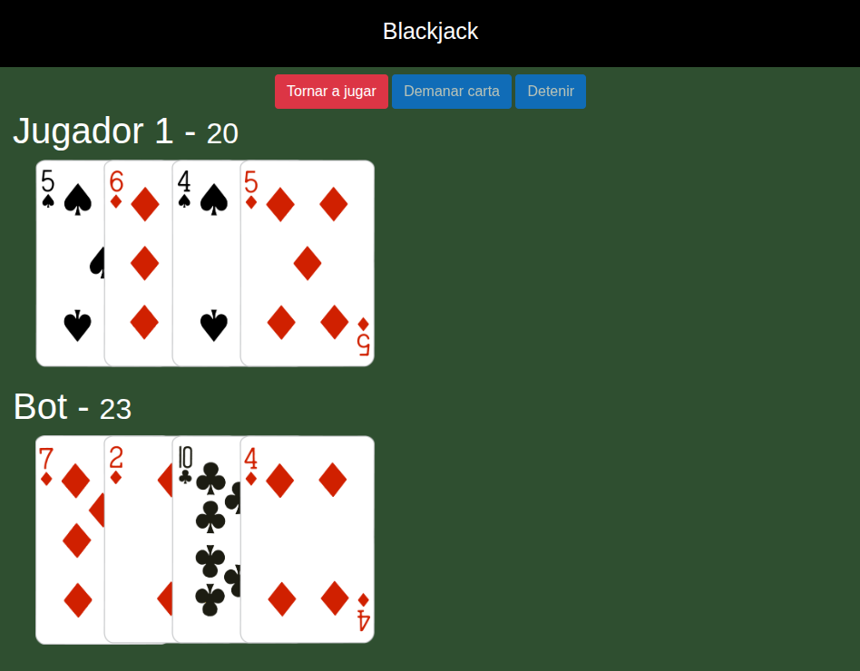

# Blackjack con JavaScript

Juego de cartas Blackjack desarrollado con JavaScript.

## Tecnologías

- HTML5, CSS, JavaScript, Lodash 

## Funcionalidades

- Generación automática del mazo.
- Reparto aleatorio de cartas.
- Cálculo de puntuación.
- Turno del jugador (pedir carta o detener).
- Turno automático del ordenador.
- Reinicio de partida.

## Cómo ejecutarlo

1. Clona el repositorio

```bash
git clone https://github.com/mgarciak/blackjack-js.git
```

2. Abre `index.html` en el navegador.

## Capturas



## Autor

Marc Garcia Picon
